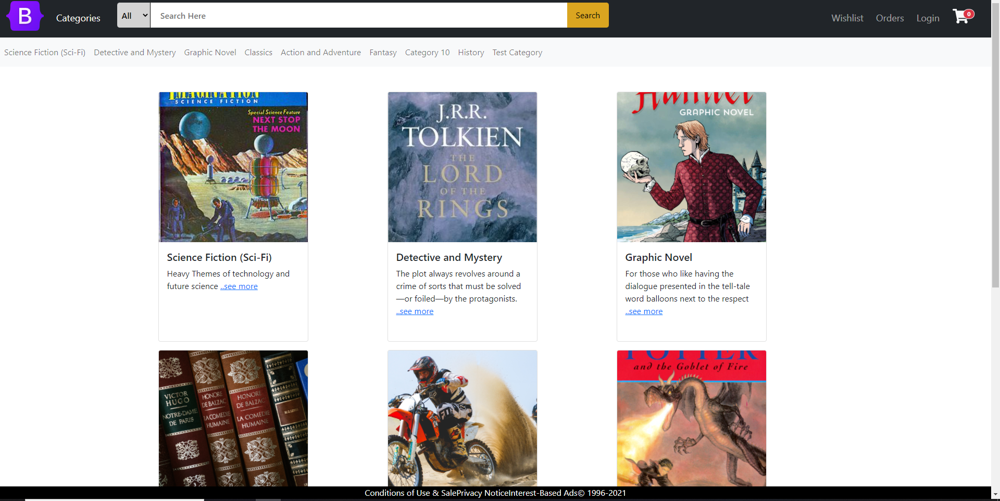
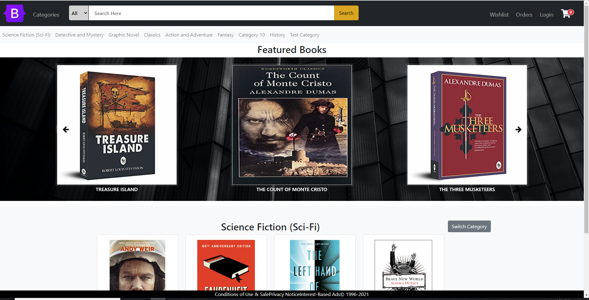
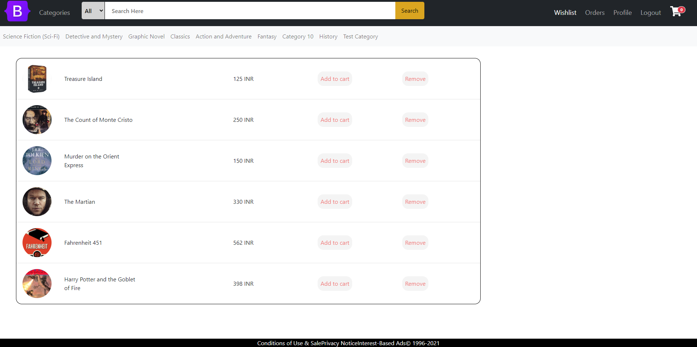

# BookStore-Frontend:
A web app developed using Angular for simulating a Bookstore.

# Dependencies:
- Bootstrap
- Font Awesome
- ng-bootstrap

# Run the application Locally

`git clone https://github.com/Nami2012/BookStore-Frontend.git` \
`npm install` \
`ng serve` 

<b> This web app is integrated with a collection of web APIs which can be found [here](https://github.com/Nami2012/BookStore-Backend.git) </b>

# Sample view of the Application

### Category

### Home

### Wishlist

